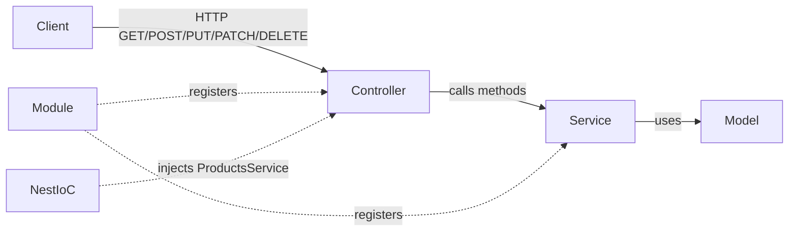
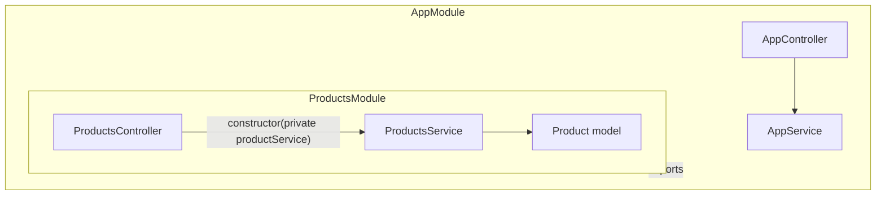
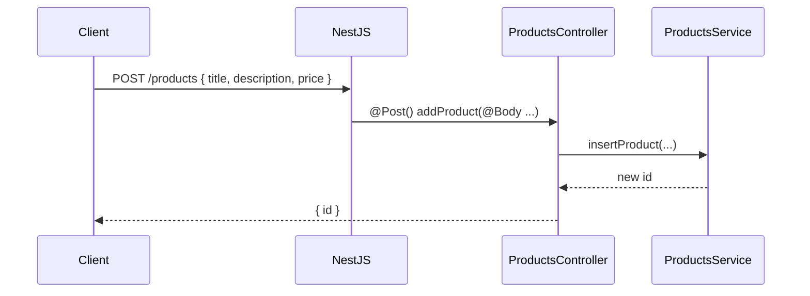
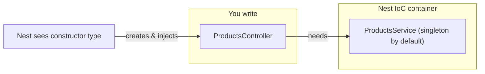
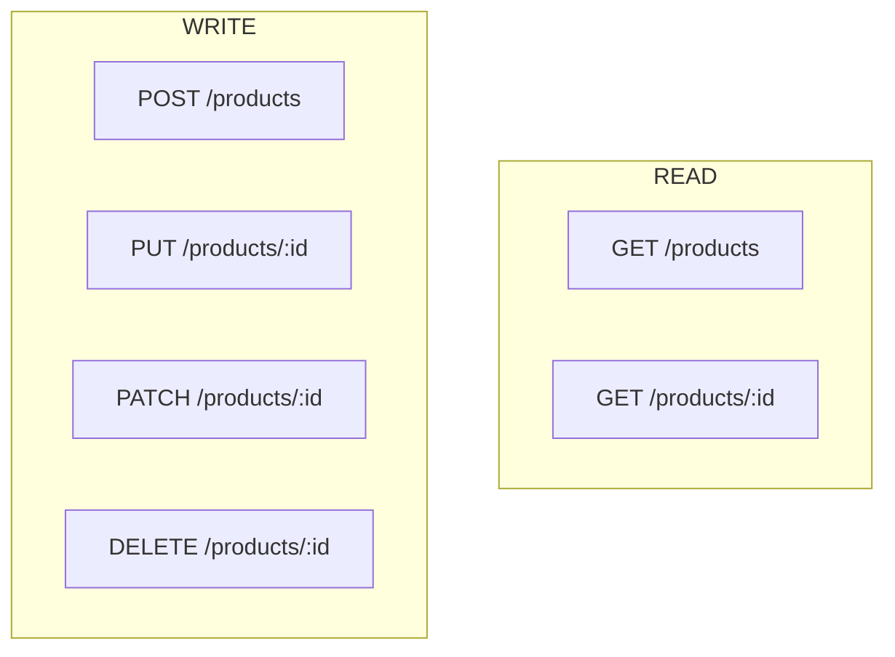

# NestJS — Revision & Interview Notes

Short answers, one-line examples from **this project**, and visuals you can recall in interviews.

---

## 30-second pitch

**NestJS** is a TypeScript Node.js framework for building scalable APIs. It uses **decorators**, **modules**, and **Dependency Injection** (like Angular) on top of Express (or Fastify).

```ts
const app = await NestFactory.create(AppModule); // bootstraps the app from the root module
```

---

## Big picture (recall this first)

```
 Client (HTTP)
      │
      ▼
┌─────────────┐     ┌──────────────┐     ┌─────────────┐
│ Controller  │ ──► │   Service    │ ──► │  Data/Model │
│ (routes)    │     │ (business)   │     │  (shape)    │
└─────────────┘     └─────────────┘     └─────────────┘
      ▲                    ▲
      │         Nest IoC injects Service into Controller
      │
 @Module({ controllers, providers, imports })
```



**Interview line:** Controller handles HTTP. Service holds logic. Module wires them. Nest's IoC container injects the service into the controller.

---

## This project's map

```
AppModule
 ├── AppController / AppService
 └── imports ProductsModule
        ├── ProductsController  →  /products
        └── ProductsService     →  in-memory Product[]
```



| File | Role |
|------|------|
| `src/main.ts` | Starts the HTTP server |
| `src/app.module.ts` | Root module |
| `src/products/products.module.ts` | Feature module |
| `src/products/products.controller.ts` | Routes for `/products` |
| `src/products/products.service.ts` | Create / read / update / delete logic |
| `src/products/products.model.ts` | `Product` shape |

---

## Request lifecycle



1. Request hits Nest (Express under the hood).
2. Route decorator (`@Get`, `@Post`, …) picks the handler.
3. Parameter decorators (`@Param`, `@Body`) extract data.
4. Controller calls the injected service.
5. Service returns data (or throws `NotFoundException`).
6. Nest serializes the return value as JSON.

---

## Core concepts

### 1. Decorator

**What:** A function that adds metadata to a class, method, or parameter. Nest reads that metadata to know “this is a controller”, “this is GET /products”, etc.

**Interview:** TypeScript decorators + `reflect-metadata`. Nest is metadata-driven: you annotate, the framework wires routing and DI.

```ts
@Controller('products')   // class decorator
@Get(':id')               // method decorator
getProduct(@Param('id') id: string) {}  // param decorator
```

---

### 2. Dependency Injection (DI)

**What:** You declare what a class needs; Nest creates and injects it. You do not `new ProductsService()` yourself.

**Interview:** Inversion of Control. Nest's IoC container instantiates providers and injects them via the constructor. Makes code testable (swap a mock service).

```ts
constructor(private productService: ProductsService) {} // Nest injects it
```



**Default scope:** singleton — one `ProductsService` shared for the whole app.

---

### 3. `@Module()` decorator

**What:** Groups related controllers and providers. The building block of a Nest app.

**Interview:** A module is a cohesive feature. `imports` bring other modules, `controllers` handle routes, `providers` are injectable classes, `exports` share providers with other modules.

```ts
@Module({
  controllers: [ProductsController],
  providers: [ProductsService],
})
export class ProductsModule {}
```

| Key | Meaning |
|-----|---------|
| `imports` | Other modules this module needs |
| `controllers` | Route handlers in this module |
| `providers` | Services / injectables Nest can inject |
| `exports` | Providers other modules may reuse |

Root module example:

```ts
@Module({
  imports: [ProductsModule],
  controllers: [AppController],
  providers: [AppService],
})
export class AppModule {}
```

---

### 4. Controller

**What:** Maps HTTP requests to methods. Thin: parse input, call service, return response.

**Interview:** Controllers are the entry point for HTTP. They should not contain business logic — that belongs in services.

```ts
@Controller('products')  // base path → /products
export class ProductsController { ... }
```

---

### 5. Provider / Service / `@Injectable()`

**What:** A class Nest can inject. Services hold business logic.

**Interview:** Anything listed in `providers` can be injected. `@Injectable()` marks the class so Nest can manage it and inject *its* dependencies too.

```ts
@Injectable()
export class ProductsService {
  product: Product[] = [];
}
```

---

### 6. Model

**What:** The shape of your data. Here it is a plain TypeScript class (not a DB entity yet).

```ts
export class Product {
  constructor(
    public id: string,
    public title: string,
    public description: string,
    public price: number,
  ) {}
}
```

---

## HTTP methods (CRUD)

This app's API:

| Method | Route | Meaning | This project |
|--------|--------|---------|--------------|
| **GET** | `/products` | Read all | `getProducts()` |
| **GET** | `/products/:id` | Read one | `getProduct(id)` |
| **POST** | `/products` | Create | `addProduct(...)` |
| **PUT** | `/products/:id` | Replace whole resource | `updateProduct(...)` |
| **PATCH** | `/products/:id` | Update some fields | `partialUpdate(...)` |
| **DELETE** | `/products/:id` | Remove | `removeProduct(id)` |



### GET — read (safe, idempotent)

```ts
@Get()
getProducts() {
  return this.productService.getProducts();
}
```

### GET with param — read one

```ts
@Get(':id')
getProduct(@Param('id') id: string) {
  return this.productService.getProduct(id);
}
```

### POST — create (not idempotent)

```ts
@Post()
addProduct(@Body('title') pTitle: string, @Body('description') pDesc: string, @Body('price') pPrice: number) {
  return { id: this.productService.insertProduct(pTitle, pDesc, pPrice) };
}
```

### PUT vs PATCH — interview favorite

| | **PUT** | **PATCH** |
|--|---------|-----------|
| Intent | Replace the **whole** resource | Update **only sent** fields |
| Missing fields | Treated as cleared / null | Left unchanged |
| Idempotent | Yes | Usually yes for simple updates |

**PUT** in this project — fields you omit become `null`:

```ts
@Put(':id')
updateProduct(@Param('id') id: string, @Body() productData: Product) { ... }
```

**PATCH** in this project — spread existing product, then overlay body:

```ts
@Patch(':id')
partialUpdate(@Param('id') id: string, @Body() productData: Product) { ... }
// service: { ...product, ...productData }
```

**One-liner for interviews:** PUT = full replace. PATCH = partial update.

### DELETE — remove

```ts
@Delete(':id')
removeProduct(@Param('id') id: string) {
  this.productService.removeProduct(id);
  return { message: 'Product removed successfully' };
}
```

---

## Parameter decorators (how data enters the handler)

| Decorator | From | Example |
|-----------|------|---------|
| `@Param('id')` | URL path | `/products/123` → `'123'` |
| `@Body()` | JSON body | whole object |
| `@Body('title')` | One body field | `'iPhone'` |
| `@Query('page')` | Query string | `?page=2` (not used here yet) |

```ts
@Get(':id')
getProduct(@Param('id') id: string) { ... }

@Post()
addProduct(@Body('title') pTitle: string) { ... }
```

---

## Exceptions

**Interview:** Throw Nest HTTP exceptions from the service; Nest turns them into the right status code.

```ts
throw new NotFoundException('Product not found'); // → 404 JSON
```

---

## Bootstrap (`main.ts`)

```ts
const app = await NestFactory.create(AppModule);
await app.listen(process.env.PORT ?? 3000);
```

**Interview:** `NestFactory.create(AppModule)` builds the DI graph from the root module, then starts the HTTP server.

---

## Quick interview Q&A

| Question | Short answer |
|----------|----------------|
| Why NestJS over Express? | Structure, DI, modules, TypeScript, built-in patterns (guards, pipes, interceptors). Express is still underneath. |
| What is a module? | A class with `@Module()` that registers controllers, providers, and imports. |
| What is DI? | Nest creates dependencies and injects them; you declare them in the constructor. |
| Controller vs Service? | Controller = HTTP. Service = business logic. |
| PUT vs PATCH? | PUT replaces the resource. PATCH updates part of it. |
| Why `@Injectable()`? | Marks a class as a provider Nest can instantiate and inject. |
| What is a decorator? | Metadata annotation Nest uses for routing, DI, and params. |
| Default provider scope? | Singleton. |
| How does Nest know the route? | `@Controller('products')` + `@Get(':id')` → `GET /products/:id`. |
| What happens on missing product? | Service throws `NotFoundException` → HTTP 404. |

---

## Mental checklist (draw this in an interview)

```
@Module  →  registers  →  Controller + Provider
                │
                ▼
         constructor(private service: Service)
                │
                ▼
    @Get @Post @Put @Patch @Delete
                │
                ▼
         @Param  /  @Body
                │
                ▼
            Service methods
                │
                ▼
         Model / data store
```

---

## Run this project

```bash
npm install
npm run start:dev
```

Server: `http://localhost:3000`

Try:

```bash
curl -X POST http://localhost:3000/products \
  -H "Content-Type: application/json" \
  -d '{"title":"Book","description":"Nest notes","price":10}'

curl http://localhost:3000/products
```
