# NestJS — Practice notebook

Revision + interview notes for **this project**. Add a new numbered unit when you practice a topic. Do not rewrite old units — append notes under **Practice notes**.

---

## How to use this file

| Marker | Meaning |
|--------|---------|
| ✅ | Practiced in this repo — notes filled |
| 📝 | Next / later — skeleton ready, fill while you code |

**When you start a new topic** (Pipes, Guards, …):

1. Find its unit below (or copy the template at the bottom).
2. Flip `📝` → `✅`.
3. Fill **What / Interview / Example / Visual**.
4. Dump experiments under **Practice notes** (date + what you tried + what broke).
5. Add 1–2 rows to [Interview Q&A](#interview-qa).

```markdown
## N. Topic name — ✅

**One-liner:** …
**In the pipeline:** …

**What:**
**Interview:**
**Example:** (from this project)
**Visual:**

### Practice notes
- YYYY-MM-DD — what I built / what I learned / gotcha
```

---

## Learning path

Official-ish Nest order. Request flows **top → bottom**.

```
 Incoming request
      │
      ▼
  07 Middleware          📝   logger, cors, raw Express-style
      │
      ▼
  08 Guards              📝   can this request proceed? (auth)
      │
      ▼
  09 Interceptors (pre)  📝   wrap before handler (timing, map)
      │
      ▼
  10 Pipes               ✅   transform + validate input
      │
      ▼
  03 Controller          ✅   pick route, pull params
      │
      ▼
  04 Service / DI        ✅   business logic
      │
      ▼
  09 Interceptors (post) 📝   wrap after handler
      │
      ▼
  11 Exception filters   📝   shape errors (if thrown)
      │
      ▼
   HTTP response
```

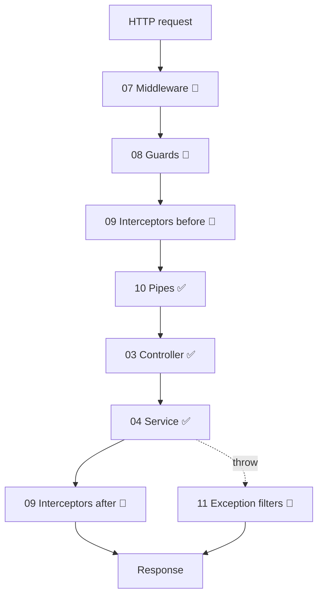

| # | Unit | Status |
|---|------|--------|
| 00 | [Overview & project map](#00-overview--project-map) | ✅ |
| 01 | [Decorators](#01-decorators-) | ✅ |
| 02 | [Modules](#02-modules-) | ✅ |
| 03 | [Controllers & HTTP methods](#03-controllers--http-methods-) | ✅ |
| 04 | [Providers, services & DI](#04-providers-services--di-) | ✅ |
| 05 | [Request data (`@Param` `@Query` `@Req` `@Res` `@HttpCode` `HttpStatus`)](#05-request-data-) | ✅ |
| 06 | [Exceptions (throwing)](#06-exceptions-throwing-) | ✅ |
| 07 | [Middleware](#07-middleware-) | 📝 |
| 08 | [Guards](#08-guards-) | 📝 |
| 09 | [Interceptors](#09-interceptors-) | 📝 |
| 10 | [Pipes](#10-pipes-) | ✅ |
| 11 | [Exception filters](#11-exception-filters-) | 📝 |
| 12 | [Custom providers / scope](#12-custom-providers--scope-) | 📝 |
| — | [Interview Q&A](#interview-qa) | living |
| — | [Run the app](#run-the-app) | — |

---

## 00. Overview & project map

**One-liner:** NestJS is a TypeScript Node framework: modules + decorators + DI on top of Express (or Fastify).

```ts
const app = await NestFactory.create(AppModule); // bootstraps from the root module
```

**Interview:** `NestFactory.create(AppModule)` builds the DI graph, then starts HTTP.

```
 Client
   → Controller (routes)
     → Service (logic)
       → Model (shape)
 Module registers both; IoC injects Service into Controller
```

```
AppModule
 ├── AppController / AppService     →  built-in Parse* pipes
 ├── AuthController                 →  /auth  (DTO + custom pipes)
 └── imports ProductsModule
        ├── ProductsController  →  /products
        └── ProductsService     →  in-memory Product[]
```

| File | Role |
|------|------|
| `src/main.ts` | Starts the HTTP server + **global** `ValidationPipe` |
| `src/app.module.ts` | Root module |
| `src/app.controller.ts` | Built-in param pipes (`ParseIntPipe`, …) |
| `src/auth/auth.controller.ts` | `/auth` routes + `@UsePipes` |
| `src/auth/auth.dto.ts` | DTO + `class-validator` / `class-transformer` |
| `src/auth/customPipe/customPipe.ts` | Custom `PipeTransform` (value + metadata) |
| `src/auth/customPipe/phoneAuth.ts` | Custom phone validation pipe |
| `src/products/products.module.ts` | Feature module |
| `src/products/products.controller.ts` | Routes for `/products` |
| `src/products/products.service.ts` | CRUD logic |
| `src/products/products.model.ts` | `Product` shape |

### Practice notes

- — bootstrap + products CRUD in memory

---

## 01. Decorators — ✅

**One-liner:** Functions that attach **metadata**. Nest reads it to wire routes, DI, and params.

**Interview:** TypeScript decorators + `reflect-metadata`. You annotate; the framework does the wiring.

```ts
@Controller('products')   // class
@Get(':id')               // method
getProduct(@Param('id') id: string) {}  // param
```

```
@class on the class          @method on a handler         @param on an argument
@Module / @Controller        @Get / @Post / @HttpCode     @Param / @Body / @Req
@Injectable / @Catch         @UseGuards / @Header         @Query / @Headers
```

`*` = used in this project.

### Class — what is this class?

| Decorator | Does this |
|-----------|-----------|
| `@Module()` * | Registers controllers, providers, imports, exports. |
| `@Global()` | Exports available app-wide (no import needed). |
| `@Controller('path')` * | HTTP controller; `'path'` is the base route. |
| `@Injectable()` * | Provider Nest can create and inject. |
| `@Inject('TOKEN')` | Inject a custom token, not a class type. |
| `@Optional()` | Constructor dep may be missing. |
| `@Catch(HttpException)` | Exception filter for that error type. |
| `@SetMetadata('key', val)` | Custom metadata (roles/guards read this). |

### HTTP — which verb + path?

| Decorator | Does this |
|-----------|-----------|
| `@Get('path')` * | GET (read). `()` = controller base path. |
| `@Post('path')` * | POST (create). |
| `@Put('path')` * | PUT (replace whole resource). |
| `@Patch('path')` * | PATCH (partial update). |
| `@Delete('path')` * | DELETE (remove). |
| `@Head('path')` | HEAD (headers only). |
| `@Options('path')` | OPTIONS (CORS / allowed methods). |
| `@All('path')` | Every HTTP method on that path. |

### Params — pull this from the request

| Decorator | Does this |
|-----------|-----------|
| `@Param('id')` * | URL path (`/products/:id`). |
| `@Body()` * | JSON body. `@Body('title')` = one field. |
| `@Query('page')` | Query string (`?page=2`). |
| `@Headers('user-agent')` | One header (or all if no name). |
| `@Req()` / `@Request()` * | Whole Express/Fastify request. |
| `@Res()` / `@Response()` | Whole response — you must send it yourself. |
| `@Next()` | Express `next()`. |
| `@Session()` | `req.session`. |
| `@Ip()` | Client IP. |
| `@HostParam('host')` | Host/subdomain param. |
| `@UploadedFile()` / `@UploadedFiles()` | Uploads (needs interceptor). |

### Handler extras — how to run / respond

| Decorator | Does this | Practice unit |
|-----------|-----------|---------------|
| `@HttpCode(201)` | Set success status (ignored if `@Res()` sends the reply). | 03 / 05 |
| `@Header(...)` | Set a response header. | 03 |
| `@Redirect(...)` | Redirect. | 03 |
| `@UseGuards(...)` | Auth / roles before handler. | 08 |
| `@UseInterceptors(...)` | Wrap before/after handler. | 09 |
| `@UsePipes(...)` * | Transform + validate input. | 10 |
| `@UseFilters(...)` | Catch errors for class/method. | 11 |
| `@Version('1')` | API versioning. | later |

**Interview:** Class = *what it is*. Method = *which route*. Param = *which slice of the request*.

### Practice notes

- —

---

## 02. Modules — ✅

**One-liner:** A feature box: registers controllers + providers and can import/export other modules.

**Interview:** Cohesive feature. `imports` / `controllers` / `providers` / `exports`.

```ts
@Module({
  controllers: [ProductsController],
  providers: [ProductsService],
})
export class ProductsModule {}
```

| Key | Meaning |
|-----|---------|
| `imports` | Other modules this one needs |
| `controllers` | Route handlers |
| `providers` | Injectables Nest can create |
| `exports` | Providers other modules may reuse |

Root:

```ts
@Module({
  imports: [ProductsModule],
  controllers: [AppController],
  providers: [AppService],
})
export class AppModule {}
```

### Practice notes

- —

---

## 03. Controllers & HTTP methods — ✅

**One-liner:** Controller maps HTTP → methods. Keep it thin; logic lives in the service.

```ts
@Controller('products')  // → /products
export class ProductsController { ... }
```

| Method | Route | Meaning | Handler |
|--------|--------|---------|---------|
| **GET** | `/products` | Read all | `getProducts()` |
| **GET** | `/products/:id` | Read one | `getProduct(id)` |
| **POST** | `/products` | Create | `addProduct(...)` |
| **PUT** | `/products/:id` | Replace whole | `updateProduct(...)` |
| **PATCH** | `/products/:id` | Update some fields | `partialUpdate(...)` |
| **DELETE** | `/products/:id` | Remove | `removeProduct(id)` |

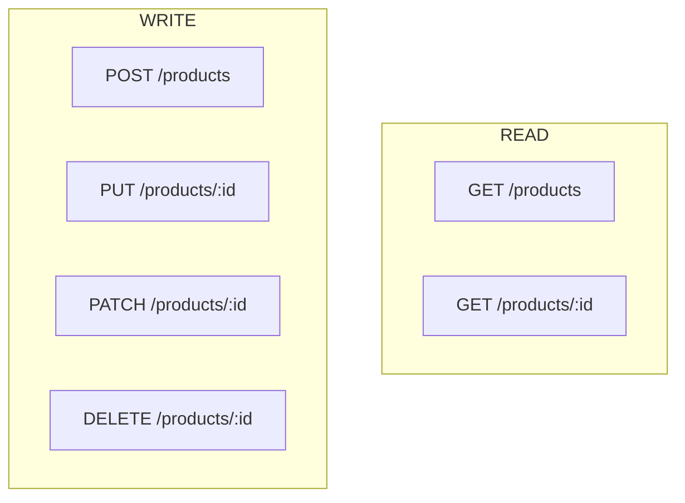

**GET** — safe, idempotent:

```ts
@Get()
getProducts() {
  return this.productService.getProducts();
}

@Get(':id')
getProduct(@Param('id') id: string) {
  return this.productService.getProduct(id);
}
```

**POST** — create, not idempotent:

```ts
@Post()
addProduct(@Body('title') pTitle: string, @Body('description') pDesc: string, @Body('price') pPrice: number) {
  return { id: this.productService.insertProduct(pTitle, pDesc, pPrice) };
}
```

**PUT vs PATCH** (interview favorite):

| | **PUT** | **PATCH** |
|--|---------|-----------|
| Intent | Replace the **whole** resource | Update **only sent** fields |
| Missing fields | Cleared / null in this project | Left unchanged |
| Idempotent | Yes | Usually yes for simple updates |

```ts
@Put(':id')
updateProduct(@Param('id') id: string, @Body() productData: Product) { ... }

@Patch(':id')
partialUpdate(@Param('id') id: string, @Body() productData: Product) { ... }
// service: { ...product, ...productData }
```

**One-liner:** PUT = full replace. PATCH = partial update.

**DELETE:**

```ts
@Delete(':id')
removeProduct(@Param('id') id: string) {
  this.productService.removeProduct(id);
  return { message: 'Product removed successfully' };
}
```

### `@HttpCode()` — Nest sets the status

When you `return` data, Nest picks the status. Override it with `@HttpCode(HttpStatus.NO_CONTENT)` (same as `204`).

| Method | Nest default | Common override |
|--------|--------------|-----------------|
| GET, PUT, PATCH, DELETE | **200** `HttpStatus.OK` | DELETE often `@HttpCode(HttpStatus.NO_CONTENT)` |
| POST | **201** `HttpStatus.CREATED` | `@HttpCode(HttpStatus.OK)` if you don't want 201 |

```ts
import { HttpCode, HttpStatus } from '@nestjs/common';

@Get()
@HttpCode(HttpStatus.NO_CONTENT) // 204
noContent() {
  return; // Nest sends 204, empty body
}
```

If you also inject `@Res()` and call `res.status(...)`, **that wins** — see [unit 05](#httpcode-vs-resstatus).

### Practice notes

- —

---

## 04. Providers, services & DI — ✅

**One-liner:** You declare what a class needs; Nest creates and injects it. No `new ProductsService()`.

**Interview:** IoC container + constructor injection. Default **singleton**. Testable (swap a mock).

```ts
constructor(private productService: ProductsService) {}

@Injectable()
export class ProductsService {
  product: Product[] = [];
}
```

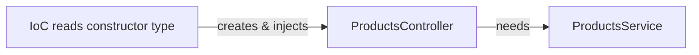

**Model** (plain class for now, not a DB entity):

```ts
export class Product {
  constructor(
    public id: string,
    public title: string,
    public description: string,
    public price: number,
  ) {}
}
```

### Practice notes

- —

---

## 05. Request data — ✅

**One-liner:** Param decorators extract slices of the HTTP request into handler arguments.

| Decorator | From | Example |
|-----------|------|---------|
| `@Param('id')` | URL path | `/products/123` → `'123'` |
| `@Body()` | JSON body | whole object |
| `@Body('title')` | One body field | `'iPhone'` |
| `@Query('page')` | Query string | `?page=2` |
| `@Headers('user-agent')` | One header | `'Mozilla/...'` |
| `@Req()` | Whole request | `req.params`, `req.query`, `req.headers` |
| `@Res()` | Express response | only if you send the response yourself |

### `@Query()` — `?` and `&`

**What:** Reads the **query string** — the optional `key=value` pairs after `?` in the URL. Not part of the route path.

**How a URL is split:**

```
http://localhost:3000/42?name=Rajnish&age=25
                      │  │            │
                      │  │            └── &  next pair (age=25)
                      │  └── ?  query string starts (name=Rajnish)
                      └── path param  @Param('id') → "42"
```

| Symbol | Meaning |
|--------|---------|
| `?` | Starts the query string. Everything after `?` is query, not the path. **Once per URL.** |
| `&` | Separates the next `key=value` pair. Repeat for more keys. |
| `=` | Assigns a value to a key. |

```
?name=Rajnish              → one pair
?name=Rajnish&age=25       → two pairs
?name=Rajnish&age=25&city=Pune  → three pairs
```

No `?` → no query (`name` and `age` are `undefined`).

**Interview:** `@Param` = path (`/products/:id`). `@Query` = optional filters after `?`. Query values are **strings** unless a pipe converts them (`ParseIntPipe` → unit 10). Prefer `@Query('name')` for one key; `@Query()` for the whole object.

**This project** (`src/app.controller.ts`):

```ts
@Get(':id')
fetchQuery(
  @Param('id') id: string,
  @Query('name') name: string,
  @Query('age') age: number,  // still a string at runtime without a pipe
) {
  return { ID: `${id}`, Name: `${name}`, Age: `${age}` };
}
```

```bash
curl "http://localhost:3000/42?name=Rajnish&age=25"
# → { "ID": "42", "Name": "Rajnish", "Age": "25" }
```

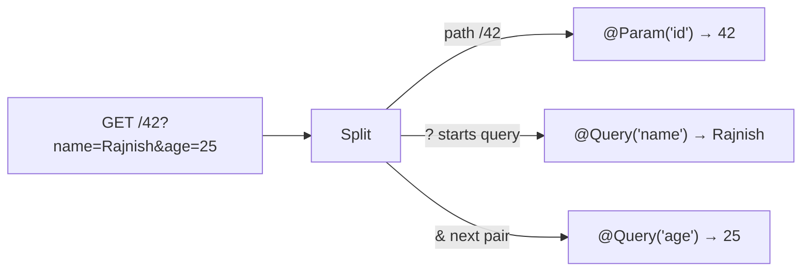

| Want | Decorator | Example URL |
|------|-----------|-------------|
| One query key | `@Query('name') name: string` | `?name=Rajnish` |
| All query keys | `@Query() query: Record<string, string>` | `?name=Rajnish&age=25` → `{ name, age }` |
| Same data via `@Req()` | `req.query` | `{ name: 'Rajnish', age: '25' }` |

**`@Param` vs `@Query`**

| | `@Param('id')` | `@Query('name')` |
|--|----------------|------------------|
| In the URL | Path: `/42` | After `?`: `?name=Rajnish` |
| Required for the route? | Yes if the route is `:id` | No — omit `?` and it is `undefined` |
| Typical use | Resource id | Filters, pagination, search: `?page=1&limit=10` |

**One-liner:** `?` starts query params; `&` joins more `key=value` pairs. `@Query('x')` reads `x`.

---

### `@Req()` and `Request`

**What:** Raw Express `Request`. Use when you need several pieces at once.

**Interview:** Prefer `@Param` / `@Body` / `@Query` for one field. `@Req()` is the escape hatch. Type as Express `Request` (or Fastify's type if you switch).

```ts
@Get(':id')
fetchReq(@Req() req: Request) {
  const { id } = req.params;
  const queryParams = req.query;
  const userAgent = req.headers['user-agent'];
  return { id, queryParams, userAgent }; // Nest sends JSON for you
}
```

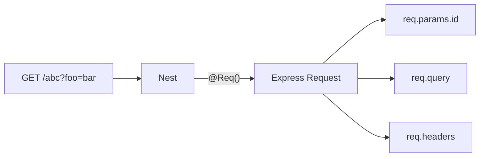

| Piece | Via `@Req()` | Specific decorator |
|-------|----------------|--------------------|
| Path `:id` | `req.params.id` | `@Param('id')` |
| Query | `req.query` | `@Query()` |
| Headers | `req.headers['user-agent']` | `@Headers('user-agent')` |
| Body | `req.body` | `@Body()` |

---

### `@Res()` and `Response`

**What:** Raw Express `Response`. You take over sending the HTTP response (`res.status().send()`, `res.json()`, cookies, HTML, streams).

**Interview:** `@Req()` reads the incoming request. `@Res()` writes the outgoing response. By default Nest **stops auto-sending** your `return` value — you **must** call `res.send` / `res.json` / `res.end` yourself. Prefer returning from the handler unless you need Express APIs (HTML, cookies, streaming).

**This project** (`src/app.controller.ts`):

```ts
import { Controller, Get, Req, Res } from '@nestjs/common';
import type { Request, Response } from 'express';

@Controller()
export class AppController {
  @Get(':id')
  fetchReq(@Req() req: Request, @Res() res: Response) {
    const { id } = req.params;
    const queryParams = req.query;
    const userAgent = req.headers['user-agent'];

    return res.status(500).send(`
      <script>
        console.log('ID: ${id}');
      </script>
    `); // you sent it — Nest will not wrap this as JSON
  }
}
```

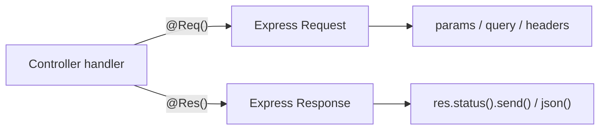

| | `@Req()` | `@Res()` |
|--|----------|----------|
| Object | Incoming **request** | Outgoing **response** |
| Typical use | Read params, query, headers | Custom status, HTML, cookies, streams |
| Nest auto-JSON? | Yes, if you `return` data | **No** (unless `passthrough: true`) |
| You must | — | Call `res.send` / `res.json` / `res.end` |

**Gotcha — who sends the response?**

```ts
@Get()
standard() {
  return { ok: true };           // Nest sends 200 JSON
}

@Get()
libraryMode(@Res() res: Response) {
  res.json({ ok: true });        // you send it; a bare `return { ok: true }` is ignored
}

@Get()
both(@Res({ passthrough: true }) res: Response) {
  res.setHeader('X-Custom', '1');
  return { ok: true };           // Nest still sends the return value
}
```

**One-liner:** `@Res()` = Express `Response`. Default = you own the reply. `@Res({ passthrough: true })` = set headers/cookies, Nest still serializes `return`.

**TS gotcha:** same as `Request` — type-only import:

```ts
import type { Request, Response } from 'express';  // correct
import { Request, Response } from 'express';       // error with emitDecoratorMetadata + isolatedModules
```

---

### `@HttpCode()` vs `res.status()`

**What:** Two ways to set the **HTTP status**. `@HttpCode` is Nest (used when Nest sends the response). `res.status()` is Express (used when you injected `@Res()`).

**Interview:** `@HttpCode` only applies if Nest is still in charge of the reply. Inject `@Res()` without `passthrough` → Nest steps aside → `@HttpCode` is **ignored**. The number that actually goes on the wire is `res.status(...)`.

**This project** (`AppController.getAll`):

```ts
@Get()
@HttpCode(HttpStatus.OK)        // Nest would send 200 — but never gets to
getAll(@Res() res: Response) {
  return res.status(200).json({
    message:
      'HttpCode status code will be hidden here because of Response object',
  });
}
```

Client sees **200** from `res.status(200)`, not from `@HttpCode`. (`HttpStatus.OK` **is** 200 — here Express still wins because `@Res()` owns the reply.)

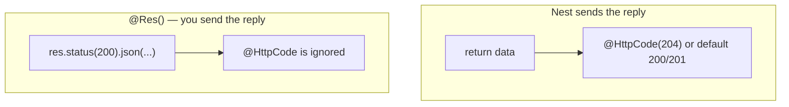

| | `@HttpCode(204)` | `res.status(200)` |
|--|------------------|-------------------|
| Who | Nest | Express `Response` |
| When it runs | You `return` (no `@Res()`, or `passthrough: true`) | You injected `@Res()` and call `res.status` / `send` / `json` |
| If both present | Lost — `@Res()` owns the response | **Wins** (this project's `getAll`) |
| Body | 204 = no content | Whatever you `json()` / `send()` |

**Who wins?**

```ts
@Get()
@HttpCode(204)
onlyNest() {
  return;                              // → 204
}

@Get()
@HttpCode(204)
overridden(@Res() res: Response) {
  return res.status(200).json({ ok: true }); // → 200  (@HttpCode hidden)
}

@Get()
@HttpCode(204)
passthrough(@Res({ passthrough: true }) res: Response) {
  res.setHeader('X-Custom', '1');
  return;                              // → 204  (Nest still sends)
}
```

**Status cheat sheet** (interview):

| Code | `HttpStatus` | Typical use |
|------|--------------|-------------|
| 200 | `OK` | GET / PUT / PATCH success |
| 201 | `CREATED` | POST success (Nest default for POST) |
| 204 | `NO_CONTENT` | DELETE / action with empty body |
| 400 | `BAD_REQUEST` | Validation failed (pipes) |
| 401 | `UNAUTHORIZED` | Not logged in (guards) |
| 403 | `FORBIDDEN` | Logged in but not allowed |
| 404 | `NOT_FOUND` | `NotFoundException` |
| 500 | `INTERNAL_SERVER_ERROR` | Unhandled throw |

---

### `HttpStatus` enum

**What:** Named constants for HTTP codes in `@nestjs/common`. `HttpStatus.OK === 200`. Prefer names over magic numbers in `@HttpCode`, `res.status()`, and `HttpException`.

**Interview:** It is a **numeric TypeScript enum**. Same number the spec uses — just readable. Works anywhere a status `number` is expected. Exceptions like `NotFoundException` already map to `HttpStatus.NOT_FOUND` (404).

```ts
import { HttpCode, HttpStatus } from '@nestjs/common';

HttpStatus.OK === 200;                    // true
@HttpCode(HttpStatus.OK)                  // Nest
res.status(HttpStatus.OK).json({ ok: true }); // Express
throw new HttpException('Nope', HttpStatus.FORBIDDEN); // 403
```

**This project:** `@HttpCode(HttpStatus.OK)` on `getAll`.

**Families (first digit):**

```
1xx  informational    HttpStatus.CONTINUE              100
2xx  success          HttpStatus.OK / CREATED / NO_CONTENT
3xx  redirect         HttpStatus.MOVED_PERMANENTLY     301
4xx  client error     HttpStatus.BAD_REQUEST / NOT_FOUND
5xx  server error     HttpStatus.INTERNAL_SERVER_ERROR 500
```

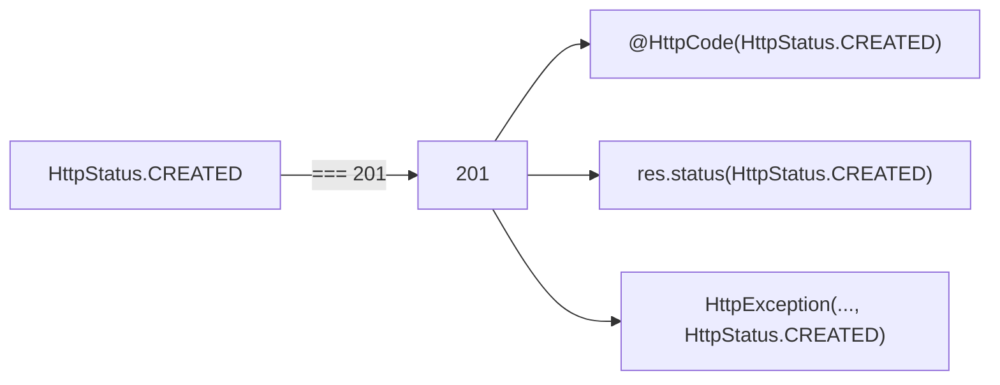

| Family | Enum members you will actually use |
|--------|-----------------------------------|
| **2xx success** | `OK` 200 · `CREATED` 201 · `ACCEPTED` 202 · `NO_CONTENT` 204 · `PARTIAL_CONTENT` 206 |
| **3xx redirect** | `MOVED_PERMANENTLY` 301 · `FOUND` 302 · `SEE_OTHER` 303 · `NOT_MODIFIED` 304 · `TEMPORARY_REDIRECT` 307 · `PERMANENT_REDIRECT` 308 |
| **4xx client** | `BAD_REQUEST` 400 · `UNAUTHORIZED` 401 · `FORBIDDEN` 403 · `NOT_FOUND` 404 · `METHOD_NOT_ALLOWED` 405 · `CONFLICT` 409 · `GONE` 410 · `PAYLOAD_TOO_LARGE` 413 · `UNPROCESSABLE_ENTITY` 422 · `TOO_MANY_REQUESTS` 429 |
| **5xx server** | `INTERNAL_SERVER_ERROR` 500 · `NOT_IMPLEMENTED` 501 · `BAD_GATEWAY` 502 · `SERVICE_UNAVAILABLE` 503 · `GATEWAY_TIMEOUT` 504 |
| Fun fact | `I_AM_A_TEAPOT` 418 (RFC joke — rarely used in real APIs) |

Full list: `node_modules/@nestjs/common/enums/http-status.enum.d.ts` (also `CONTINUE` 100, `PROCESSING` 102, `LOCKED` 423, …).

**`@HttpCode(HttpStatus.X)` vs `res.status(HttpStatus.X)`** — same enum, same rule as before: Nest vs Express. Enum does not change who wins.

```ts
@HttpCode(HttpStatus.NO_CONTENT)           // Nest sends 204
res.status(HttpStatus.OK).json({ ok: true }) // Express sends 200
```

**One-liner:** `HttpStatus` = named HTTP codes (`OK` = 200). Use it instead of raw numbers; it does not override `@Res()`.

**One-liner:** `@HttpCode` = Nest status. `res.status()` = Express status. `@Res()` without passthrough → `res.status()` wins and `@HttpCode` is hidden.

### Practice notes

- — `@Req()` + `@Res()` in `AppController.fetchReq`
- — `@Query('name')` + `@Query('age')` with `?` and `&` in `fetchQuery`
- — `@HttpCode(HttpStatus.OK)` vs `res.status(200)` in `getAll` — enum name, still hidden because of `@Res()`

---

## 06. Exceptions (throwing) — ✅

**One-liner:** Throw Nest HTTP exceptions; Nest maps them to status + JSON. Full **filters** = unit 11.

```ts
throw new NotFoundException('Product not found'); // → 404
```

**Interview:** Service throws; Nest serializes. Custom shape / catch-all → Exception filters.

### Practice notes

- —

---

## 07. Middleware — 📝

**One-liner:** Runs **first**. Express-style `(req, res, next)`. Logging, CORS, raw body, path-specific logic.

**In the pipeline:** Request → **Middleware** → Guards → …

**Hook it with:** `NestMiddleware` + `configure(consumer)` in a module (`MiddlewareConsumer`). Not a controller decorator.

**Interview:** Closest to Express middleware. Cannot inject into the DI tree as easily as guards unless you use class middleware. Applied to routes via `forRoutes` / `exclude`.

```ts
// fill when you practice
// export class LoggerMiddleware implements NestMiddleware {
//   use(req: Request, res: Response, next: NextFunction) { next(); }
// }
```

**Visual:** (add after practice)

### Practice notes

- Date:
- What I built:
- Applied globally vs `forRoutes(...)`:
- Gotcha:

---

## 08. Guards — 📝

**One-liner:** **Can this request proceed?** Returns `true` / `false` (or throws). Auth, roles, API keys.

**In the pipeline:** Middleware → **Guards** → Interceptors → Pipes → Controller

**Hook it with:** `@UseGuards(AuthGuard)` on class or method. `implements CanActivate`.

**Interview:** Guard = authorization checkpoint. Reads `ExecutionContext`. Roles often use `@SetMetadata` + `Reflector`.

```ts
// fill when you practice
// @Injectable()
// export class AuthGuard implements CanActivate {
//   canActivate(context: ExecutionContext): boolean { return true; }
// }
```

**Visual:** (add after practice)

### Practice notes

- Date:
- What I built:
- Controller-level vs method-level:
- Gotcha:

---

## 09. Interceptors — 📝

**One-liner:** **Wrap** the handler: run before *and* after. Logging time, map the response, timeout, cache.

**In the pipeline:** Guards → **Interceptor (pre)** → Pipes → Controller → **Interceptor (post)**

**Hook it with:** `@UseInterceptors(...)`. `implements NestInterceptor`. Uses RxJS `Observable`.

**Interview:** AOP. `intercept(context, next)` then `next.handle().pipe(...)`. Unlike middleware, they see the controller result. Unlike guards, they don't decide allow/deny.

```ts
// fill when you practice
// @Injectable()
// export class LoggingInterceptor implements NestInterceptor {
//   intercept(context: ExecutionContext, next: CallHandler): Observable<unknown> {
//     return next.handle();
//   }
// }
```

**Visual:** (add after practice)

### Practice notes

- Date:
- What I built:
- Before vs after (`tap` / `map`):
- Gotcha:

---

## 10. Pipes — ✅

**One-liner:** A pipe **transforms** and/or **validates** one handler argument *before* the method runs. Bad input → `BadRequestException` (400). Handler never sees garbage.

**In the pipeline:** Interceptors (pre) → **Pipes** → Controller handler

**Why we need them:** HTTP is strings. `"/pipe/int/42"` is the text `"42"`, not a number. Bodies are plain JSON, not a `AuthDto` class. Without pipes you repeat `parseInt` / `if (!email)` in every controller.

**When we use them:**
- Path/query must be a number, bool, UUID, array → built-in `Parse*Pipe`
- Body must match a DTO (`@IsEmail`, length, enum) → `ValidationPipe` + `class-validator`
- Extra business rule (phone 10–11 digits, uppercase name, Date parse) → custom `PipeTransform`

**Interview:** Pipe = `PipeTransform.transform(value, metadata)`. Two jobs: **change the shape** and **reject invalid**. Nest built-ins + `ValidationPipe`. Throw `BadRequestException` on failure.

```
 HTTP string / JSON
        │
        ▼
     Pipe  ── transform ──► number / Date / DTO instance
        │
        └── validate ──► throw 400  or  pass to handler
```

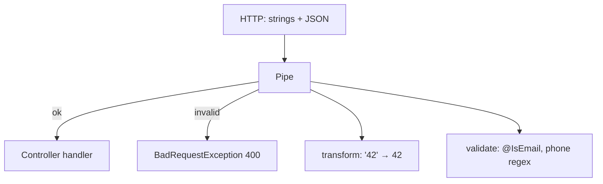

---

### `PipeTransform` — `value` and `metadata`

Every pipe implements:

```ts
export interface PipeTransform<T = any, R = any> {
  transform(value: T, metadata: ArgumentMetadata): R;
}
```

| Argument | What it is |
|----------|------------|
| **`value`** | The raw argument Nest extracted (`"42"`, `{ name, email }`, query string, …). You **return** the new value (or throw). |
| **`metadata`** | *Where* that value came from and *what TypeScript type* the parameter has. |

**`ArgumentMetadata`:**

| Field | Meaning | This project |
|-------|---------|--------------|
| **`type`** | Which decorator: `'body'` \| `'query'` \| `'param'` \| `'custom'` | `CustomPipe`: `'body'` vs `'param'` |
| **`data`** | The string you passed the decorator: `@Body('name')` → `'name'`; `@Param('id')` → `'id'`; `@Body()` (no key) → `undefined` | `metadata.data === 'name'` → `toUpperCase()` |
| **`metatype`** | The TS type of the parameter (`String`, `Number`, `Date`, `AuthDto`, …). Needs `emitDecoratorMetadata`. | `metadata.metatype === Date` → parse date |

```ts
transform(value: any, metadata: ArgumentMetadata) {
  // value    = what the client sent (for that argument)
  // metadata = { type, metatype, data }
  return value; // handler receives this
}
```

**This project's `CustomPipe`** (`src/auth/customPipe/customPipe.ts`):

```ts
transform(value: any, metadata: ArgumentMetadata) {
  if (metadata.metatype === Date) {           // TS type is Date
    value = new Date(value);
    if (isNaN(value.getTime())) throw new BadRequestException('Invalid date format');
    value = value.toUTCString();
  }
  if (metadata.type === 'body' && metadata.data === 'name') { // @Body('name')
    value = value.toUpperCase();
  } else if (metadata.type === 'param') {     // @Param('id')
    const idLength = parseInt(value, 10);
    if (!isNaN(idLength) && idLength > 0) {
      value = Math.floor(Math.random() * Math.pow(10, idLength));
    }
  }
  return value;
}
```

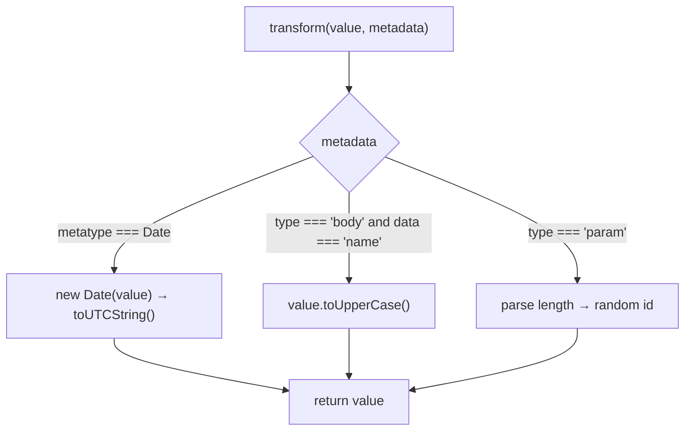

**`PhoneAuth`** uses **`value`** (the whole body: `value.phone`) and logs **`metadata.metatype`**:

```ts
transform(value: any, metadata: ArgumentMetadata) {
  if (!/^\d{10,11}$/.test(String(value.phone))) {
    throw new BadRequestException('Phone number must be 10 or 11 digits');
  }
  return value;
}
```

---

### Pipe levels (narrow → wide)

Same pipe idea; different **scope**.

```
 Parameter          only that argument
    ▲
 Route / method     every arg of that handler   @UsePipes on the method
    ▲
 Controller         every handler in the class  @UsePipes on the class
    ▲
 Global             every route in the app      app.useGlobalPipes()
```

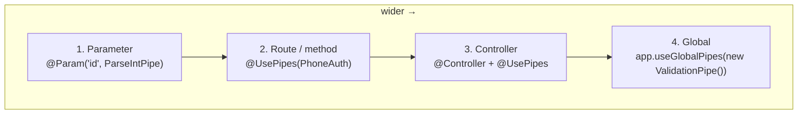

| Level | How | Runs on | This project |
|-------|-----|---------|--------------|
| **1. Parameter** | Second arg of `@Param` / `@Query` / `@Body` | That one value | `AppController` `ParseIntPipe`, `ParseFloatPipe`, `ParseBoolPipe`, `ParseArrayPipe`, `ParseUUIDPipe` |
| **2. Route / method** | `@UsePipes(...)` on the handler | All arguments of that method | `AuthController.registerUser`, `customPipe`, `getId` |
| **3. Controller** | `@UsePipes(...)` on the class | Every route in that controller | *(not used yet — same decorator, on `@Controller`)* |
| **4. Global** | `app.useGlobalPipes(...)` in `main.ts` | Entire app | `new ValidationPipe()` |

**1 — Parameter** (`src/app.controller.ts`):

```ts
@Get('pipe/int/:id')
getInt(@Param('id', ParseIntPipe) id: number) { ... }          // "42" → 42

@Get('pipe/float/:id')
getFloat(@Param('id', ParseFloatPipe) id: number) { ... }

@Get('pipe/bool')
getBool(@Query('isActive', ParseBoolPipe) isActive: boolean) { ... }

@Get('pipe/array')
getArray(@Query('num', new ParseArrayPipe({ items: Number })) num: number[]) { ... }

@Get('/pipe/uuid/:id')
getUuid(@Param('id', new ParseUUIDPipe({ version: '4' })) id: string) { ... }
```

**2 — Route** (`src/auth/auth.controller.ts`):

```ts
@Post('register')
@UsePipes(PhoneAuth)   // class — Nest instantiates (@Injectable)
registerUser(@Body() userData: AuthDto) { ... }

@Post('custom-pipe')
@UsePipes(new ValidationPipe(), new CustomPipe())  // instances, in order
customPipe(@Body('name') name: string) { ... }

@Get('/register/:id')
@UsePipes(new CustomPipe())
getId(@Param('id') id: number) { ... }
```

**3 — Controller** (pattern — add when you want every `/auth` route piped):

```ts
@Controller('auth')
@UsePipes(new ValidationPipe())
export class AuthController { ... }
```

**4 — Global** (`src/main.ts`):

```ts
app.useGlobalPipes(new ValidationPipe());
```

**Pass class vs `new`:** `@UsePipes(PhoneAuth)` → Nest constructs it (can inject deps). `@UsePipes(new CustomPipe())` → you construct it (pass options easily).

Pipes on a method run **in order**: `@UsePipes(new ValidationPipe(), new CustomPipe())` → validate first, then `CustomPipe`.

---

### Built-in parse pipes (this project)

| Pipe | Input → output | Example |
|------|----------------|---------|
| `ParseIntPipe` | `"42"` → `42` | `GET /pipe/int/42` |
| `ParseFloatPipe` | `"3.14"` → `3.14` | `GET /pipe/float/3.14` |
| `ParseBoolPipe` | `"true"` → `true` | `GET /pipe/bool?isActive=true` |
| `ParseArrayPipe({ items: Number })` | `"1,2,3"` → `[1, 2, 3]` | `GET /pipe/array?num=1,2,3` |
| `ParseUUIDPipe({ version: '4' })` | UUID string or 400 | `GET /pipe/uuid/<uuid-v4>` |
| `ValidationPipe` | plain JSON → class instance + validate | global + `@UsePipes` on auth |

---

### `class-validator` and `class-transformer`

**Why two packages:** JSON is a plain object. Decorators like `@IsEmail()` live on a **class**. Nest's `ValidationPipe` needs both:

1. **`class-transformer`** — turn `{ name: "a" }` into `new AuthDto()` (and `@Type(() => Date)` for nested types).
2. **`class-validator`** — run `@IsEmail()`, `@Length()`, `@IsEnum()`, … on that instance.

```
 JSON body
    │
    ▼
 class-transformer   @Type(() => Date)  →  AuthDto instance
    │
    ▼
 class-validator     @IsEmail @Length @IsEnum  →  400 or pass
    │
    ▼
 handler(@Body() userData: AuthDto)
```

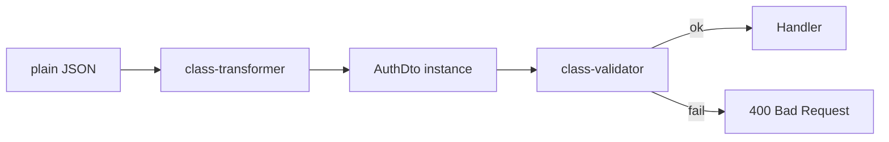

`ValidationPipe` is the Nest glue. Global in this app: `app.useGlobalPipes(new ValidationPipe())`.

**`AuthDto`** (`src/auth/auth.dto.ts`) — validators you practiced:

| Decorator | Meaning |
|-----------|---------|
| `@IsString()` | Must be a string |
| `@Length(3, 20)` | Min 3, max 20 |
| `@IsEmail()` | Valid email |
| `@IsNotEmpty()` | Required |
| `@IsAlphanumeric()` | Letters + digits |
| `@MinLength(8)` / `@MaxLength(15)` | Custom `message` + `$constraint1` |
| `@IsEnum(Country)` | Value must be in the enum |
| `@IsDateString()` | ISO date **string** (`yyyy-mm-dd`) — no `@Type` needed |
| `@IsDate()` | Real `Date` object — needs `@Type(() => Date)` because JSON dates are strings |
| `@Type(() => Date)` | **class-transformer**: string → `Date` |
| `@IsOptional()` | Skip other validators if missing |
| `@IsNumber()` | Must be a number |
| `@Matches(/regex/)` | Pattern (commented phone example) |

**`@IsDate` vs `@IsDateString` (your comment in the DTO):**

| | `@IsDate()` | `@IsDateString()` |
|--|-------------|-------------------|
| Expects | JavaScript `Date` | ISO string |
| JSON body `"2020-01-01"` | Fail unless `@Type(() => Date)` | Pass |

**Interview:** `ValidationPipe` = transform (class-transformer) + validate (class-validator). DTO holds the rules. Controller stays thin.

---

### Practice notes

- Global `ValidationPipe` in `main.ts`
- Parameter: `ParseIntPipe`, `ParseFloatPipe`, `ParseBoolPipe`, `ParseArrayPipe`, `ParseUUIDPipe` on `AppController`
- Route: `@UsePipes(PhoneAuth)` / `new ValidationPipe(), new CustomPipe()`
- `CustomPipe` branches on `metadata.metatype`, `metadata.type`, `metadata.data`
- `AuthDto` + `class-validator` / `class-transformer`; `@IsDateString` vs `@Type(() => Date)`

---


## 11. Exception filters — 📝

**One-liner:** Catch thrown errors and **shape the HTTP error body**. Unit 06 is just `throw`; this is *how it looks*.

**In the pipeline:** Anything throws → **Filter** → response

**Hook it with:** `@Catch(...)` on a filter class + `@UseFilters(...)` or `app.useGlobalFilters`.

**Interview:** `Catch` + `ExceptionFilter`. Built-in already maps `HttpException`. Custom filters for logging + consistent `{ status, message, timestamp }`.

```ts
// fill when you practice
// @Catch(HttpException)
// export class HttpExceptionFilter implements ExceptionFilter { catch(exception, host) {} }
```

**Visual:** (add after practice)

### Practice notes

- Date:
- What I built:
- Global vs controller vs method:
- Gotcha:

---

## 12. Custom providers / scope — 📝

**One-liner:** Tokens, `useClass` / `useValue` / `useFactory`, and scopes (`DEFAULT` singleton, `REQUEST`, `TRANSIENT`).

**Interview:** Default singleton. `REQUEST` = new instance per HTTP request (careful with leaks). Custom token when you don't inject a class.

### Practice notes

- Date:
- What I built:
- Gotcha:

---

## Interview Q&A

Add a row when you finish a unit.

| Question | Short answer |
|----------|----------------|
| Why NestJS over Express? | Structure, DI, modules, TypeScript; Express still underneath. |
| What is a module? | `@Module()` registering controllers, providers, imports. |
| What is DI? | Nest creates deps and injects them via the constructor. |
| Controller vs Service? | Controller = HTTP. Service = business logic. |
| PUT vs PATCH? | PUT replaces. PATCH updates part. |
| Why `@Injectable()`? | Marks a provider Nest can instantiate and inject. |
| What is a decorator? | Metadata Nest uses for routing, DI, params. |
| Three kinds of Nest decorators? | Class, method, param. |
| Default provider scope? | Singleton. |
| How does Nest know the route? | `@Controller('products')` + `@Get(':id')` → `GET /products/:id`. |
| Missing product? | `NotFoundException` → 404. |
| What is `@Query()`? | Reads `key=value` pairs after `?` in the URL. |
| What do `?` and `&` mean? | `?` starts the query string (once). `&` separates the next pair. |
| `@Param` vs `@Query`? | Param = path (`/42`). Query = optional `?name=Rajnish&age=25`. |
| What is `@Res()`? | Raw Express `Response` (you send the reply). |
| `@Req()` vs `@Param` / `@Query`? | Specific = one slice; `@Req()` = whole request. |
| `@Res()` vs `return`? | `return` → Nest sends JSON. `@Res()` → you must `res.send` / `res.json`. |
| What is `@HttpCode()`? | Nest success status when Nest sends the reply (`return`). |
| `@HttpCode` vs `res.status()`? | Nest vs Express. `@Res()` without passthrough → `res.status()` wins; `@HttpCode` is ignored. |
| What is `HttpStatus`? | Numeric enum in `@nestjs/common`. `HttpStatus.OK === 200`. Use names, not magic numbers. |
| `HttpStatus` vs `@HttpCode`? | Enum = the number. `@HttpCode` / `res.status()` = where you apply it. |
| Nest default status codes? | POST → 201 `CREATED`. GET/PUT/PATCH/DELETE → 200 `OK`. |
| Why `import type { Request }` / `Response`? | Type-only; required with `emitDecoratorMetadata` + `isolatedModules`. |
| Request pipeline order? | Middleware → Guards → Interceptors → Pipes → Controller → Interceptors → Filters (on error). |
| Middleware vs Guard? | 📝 fill in unit 07/08 |
| Guard vs Interceptor? | 📝 fill in unit 08/09 |
| What is a pipe? | Transform and/or validate a handler argument before the method runs. |
| Why pipes? | HTTP is strings; pipes turn `"42"` into `42` and reject bad DTOs with 400. |
| `PipeTransform`? | `transform(value, metadata)` — return the new value or throw. |
| What is `value` vs `metadata`? | `value` = the input. `metadata` = `{ type, metatype, data }` (body/param/query, TS type, decorator key). |
| Pipe levels? | Parameter `@Param('id', Pipe)` → method `@UsePipes` → controller `@UsePipes` → global `useGlobalPipes`. |
| `class-validator` vs `class-transformer`? | Validator = `@IsEmail` rules. Transformer = plain JSON → class (`@Type(() => Date)`). `ValidationPipe` runs both. |
| Pipe vs Interceptor? | Pipe = one argument, before handler. Interceptor = wrap whole call, before *and* after. |
| Exception vs Exception filter? | Throw (06) vs shape the error response (11). 📝 |

---

## Mental checklist

```
@Module  →  Controller + Provider
              │
     constructor(private service: Service)
              │
   Middleware → Guards → Interceptors → Pipes
              │
    @Get @Post @Put @Patch @Delete
              │
         @Param / @Query / @Body / @Req() / @Res()
              │
          Service methods
              │
     Interceptors (after) / Exception filters
```

---

## Run the app

```bash
npm install
npm run start:dev
```

`http://localhost:3000`

```bash
curl -X POST http://localhost:3000/products \
  -H "Content-Type: application/json" \
  -d '{"title":"Book","description":"Nest notes","price":10}'

curl http://localhost:3000/products
```

---

## New-unit template (copy below the last numbered unit)

```markdown
## 13. Topic name — 📝

**One-liner:**
**In the pipeline:**
**Hook it with:**
**Interview:**
**Example:**
**Visual:**

### Practice notes
- Date:
- What I built:
- Gotcha:
```
